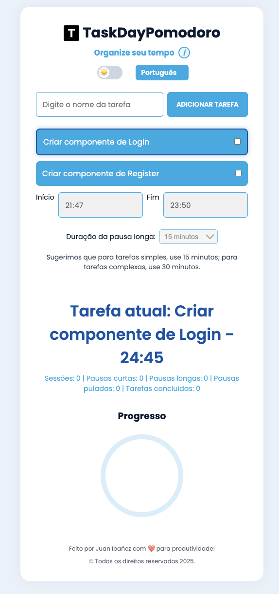
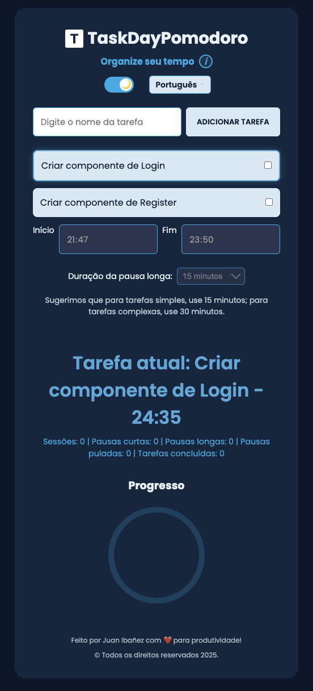

# 🍅 TaskDayPomodoro

Bem-vindo ao **TaskDayPomodoro**! 🍅  
Uma aplicação web para gerenciar seu tempo e aumentar a produtividade usando a técnica Pomodoro, com suporte a múltiplos idiomas, temas claro/escuro e estatísticas detalhadas.

## 📌 Acesse
Visite: <a href="https://dev-juan-ibanez.github.io/task-day-pomodoro/" target="_blank">TaskDayPomodoro</a>

## 🚀 O que é?
O **TaskDayPomodoro** é uma ferramenta que implementa a técnica Pomodoro, dividindo o trabalho em blocos de 25 minutos, seguidos por pausas curtas (5 minutos) e pausas longas (15-30 minutos). A aplicação permite:
- 📋 Criar, editar e excluir tarefas
- ⏰ Definir horários de início e fim para o Pomodoro
- 🕒 Configurar a duração de pausas longas
- 📊 Acompanhar o progresso com gráficos de conclusão
- 📸 Exportar estatísticas como imagem PNG
- 🌐 Suporte multilíngue (Português, Inglês e Espanhol)
- 🎨 Alternar entre temas claro e escuro
- ⏯️ Pausar e pular pausas (com contagem de pausas puladas)

## 🌐 Novidades
- Alterado o termo "Transições" para **"Pausas Puladas"** nas estatísticas para maior clareza
- Corrigido o bug na contagem de **tempo total**, agora atualizado em tempo real durante sessões e pausas
- Ajustada a contagem de **pausas puladas**, contabilizando apenas quando o usuário clica em "Pular Pausa"
- Interface aprimorada com feedback visual em tempo real para estatísticas e progresso
- Suporte multilíngue automático com detecção do idioma do navegador e opção de troca manual

## 🛠 Tecnologias Utilizadas
- **HTML5**, **CSS3**, **JavaScript**
- **Canvas API** para gráficos de progresso e conclusão
- **localStorage** para salvar tarefas, configurações de tema, idioma e horários
- **html2canvas** para exportação de estatísticas como PNG
- Tema **claro/escuro** com alternância automática baseada nas preferências do sistema
- Sistema de **internacionalização (i18n)** para suporte a múltiplos idiomas
- Hospedado gratuitamente via **GitHub Pages**

## 📸 Visualização

<p align="center">
  
  
</p>

## 💻 Como rodar localmente
1. Clone o repositório:  
   ```bash
   git clone https://github.com/dev-juan-ibanez/task-day-pomodoro.git
   ````
2. Acesse a pasta do projeto:
    ```bash
    cd task-day-pomodoro
    ````

3. Abra o arquivo index.html diretamente no navegador ou use um servidor local (ex.: live-server).

Nota: Para a funcionalidade de exportação de estatísticas como PNG, inclua a biblioteca html2canvas no projeto. Você pode adicioná-la via CDN no arquivo HTML:html
    ```javascript
        <script src="https://cdnjs.cloudflare.com/ajax/libs/html2canvas/1.4.1/html2canvas.min.js"></script>
    ```

## ☕ Gostou do projeto? Me pague um café!
Se você curtiu o projeto e quer apoiar, pode me pagar um café! ☕  
**Chave PIX**:  
```text
f0098b96-0433-4266-b392-4856d85caadc
```
**Copie e cole a chave acima para contribuir!**

## Observações
Como o projeto teve a ideia de criar uma lista de tarefas diárias com pomodoro, então é importante se atentar com o tempo das tarefas é até um pouco de 00:00 a sugestão para colocar o tempo de finalizar as tarefas.

## 🧑‍💻 Autor

Feito com ❤️ por **Juan Ibanez**  
🌎 [LinkedIn](https://www.linkedin.com/in/juan-ibanez-df/) | [GitHub](https://github.com/dev-juan-ibanez) | [Lattes](https://lattes.cnpq.br/1029223661167123)
